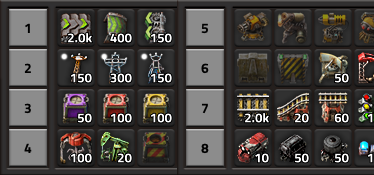
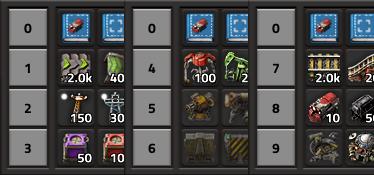
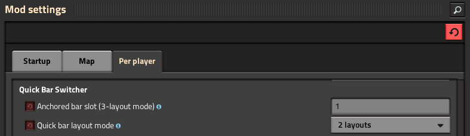
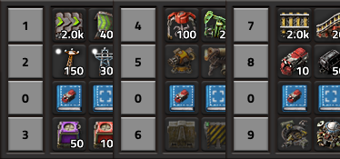

**Quick Bar Switcher** lets you multiply the usefulness of your quick bars without cluttering them. Instead of cramming everything into the 4 visible quick bar rows, you can switch between entirely different sets of bars with a single keypress — keeping your hotbar clean and context-appropriate for whatever you're doing.

---

## How It Works

Factorio provides up to 10 quick bar pages, but only 4 rows are visible at any given time. This mod lets you bind different pages to those 4 rows and switch between pre-defined groups instantly using the default hotkey **Ctrl + Q** (rebindable in Controls settings).

The mod offers two modes of operation: **2-Layout** and **3-Layout**.

---

## 2-Layout Mode

The default mode. Your 4 visible quick bar rows alternate between two complete sets of bars:

| | Slot 1 | Slot 2 | Slot 3 | Slot 4 |
|---|---|---|---|---|
| **Layout A** | Page 1 | Page 2 | Page 3 | Page 4 |
| **Layout B** | Page 5 | Page 6 | Page 7 | Page 8 |

Press **Ctrl + Q** to toggle between Layout A and Layout B. You effectively get **8 distinct quick bar pages** accessible at the tap of a key — ideal for players who want one set for construction and another for combat or logistics.

---

## 3-Layout Mode

For power users who need even more hotbar real estate. In this mode, one of the 4 visible rows becomes an **anchored bar** — it always shows the same quick bar page (page 10) regardless of which layout is active. The remaining 3 rows then cycle through **three** rotating sets:

| | Anchored Slot | Slot A | Slot B | Slot C |
|---|---|---|---|---|
| **Layout A** | Page 10 (fixed) | Page 1 | Page 2 | Page 3 |
| **Layout B** | Page 10 (fixed) | Page 4 | Page 5 | Page 6 |
| **Layout C** | Page 10 (fixed) | Page 7 | Page 8 | Page 9 |

Press **Ctrl + Q** to cycle through Layouts A → B → C → A.

This gives you access to **all 10 quick bar pages** — that's **2 extra pages** compared to 2-Layout mode. The anchored bar is perfect for items you always need regardless of context: your personal roboport, repair packs, personal construction robots, or any other universal tools.

---

## Settings

All settings are **per-player** and can be changed at any time from **Escape → Settings → Mod Settings → Per player**, even mid-game.

### Hotkey — Switch Quick Bar Pages
**Default:** `Ctrl + Q`

The keybind that triggers the layout switch. You can rebind it to anything you prefer from **Escape → Settings → Controls**, under the **Quick Bar Switcher** section.

### Quick Bar Layout Mode
**Options:** `2 layouts` / `3 layouts` — **Default:** `2 layouts`

Determines whether pressing the hotkey alternates between 2 sets of bars or cycles through 3. Choose `3 layouts` if you need access to more quick bar pages.

### Anchored Bar Slot *(3-Layout mode only)*
**Range:** `1` to `4` — **Default:** `1`

Sets which of the 4 visible quick bar rows stays fixed while the other 3 rotate. Pick the slot position that best suits your screen layout and muscle memory.

---

## Credits

- **andrevdm** — Conceived and implemented the 3-Layout mode (contributed via pull request).